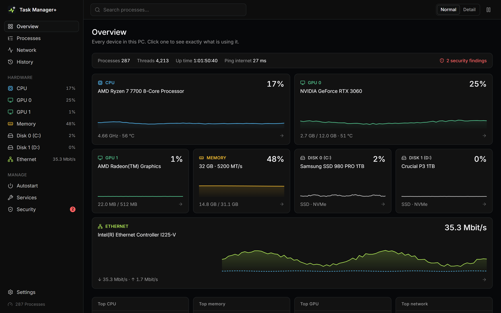
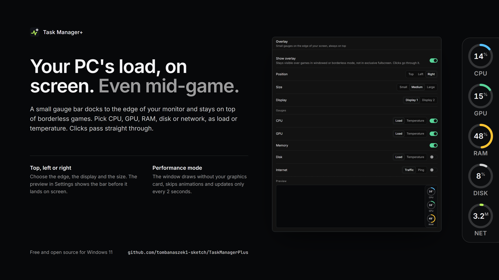

# Task Manager+

[](https://github.com/tombanaszek1-sketch/TaskManagerPlus/releases/latest)
[](https://github.com/tombanaszek1-sketch/TaskManagerPlus/releases)
[](#install)
[](LICENSE)

A free, open-source replacement for the Windows Task Manager. It shows every part of your PC and which programs are using it right now.

**[Download](https://github.com/tombanaszek1-sketch/TaskManagerPlus/releases/latest)**



## Features

- Live pages for every CPU, GPU, memory, disk and network adapter
- For each device, the programs using it, down to GPU engines and per-process disk and network traffic
- Processes grouped into apps, background programs and Windows components, with protected system processes
- Signature check that flags unsigned, broken or suspicious programs
- Autostart entries and services, switchable without deleting anything
- History of every resource, recorded each minute even while the window is closed
- Temperatures, clocks, power and fans in detail mode
- Always-on-top overlay with CPU, GPU, RAM, disk and network gauges for gaming
- Performance mode that renders the window without the graphics card



## Install

| Download | |
|---|---|
| `.msi` | Installer with Start menu shortcut, updates older versions |
| `.exe` | Portable, run it from anywhere |
| `.zip` | The portable exe, for networks that block `.exe` downloads |

Windows 10 or 11 (64-bit). The app asks for administrator rights, which it needs for per-process network and disk data, services and ending elevated processes. The builds are not code-signed, so SmartScreen may ask once: **More info > Run anyway**.

CPU temperatures need the open-source [PawnIO](https://github.com/namazso/PawnIO) driver. The MSI installs it, and the portable exe offers a one-click button.

Settings and history stay in `%LOCALAPPDATA%\TaskManagerPlus`. The only network traffic is a ping to your router and to `1.1.1.1`.

## Build

Requires the [.NET 10 SDK](https://dotnet.microsoft.com/download) and [Node.js](https://nodejs.org/) 22+.

```powershell
./build.ps1      # UI, tests, single-file exe, zip and MSI in artifacts/
dotnet test      # unit tests only
```

To work on the UI in a browser with demo data, run `npm install` and `npm run dev` in `ui/`.

| Folder | Contents |
|---|---|
| `src/TaskManagerPlus.Core` | Data collection (NT APIs, performance counters, ETW, LibreHardwareMonitor, SQLite history) |
| `src/TaskManagerPlus` | WinForms host with WebView2, tray icon and overlay |
| `ui` | Next.js interface, exported as static files |
| `tests` | xUnit tests |

## License

[MIT](LICENSE). Bundled third-party components are listed in [THIRD-PARTY-NOTICES.txt](THIRD-PARTY-NOTICES.txt).
